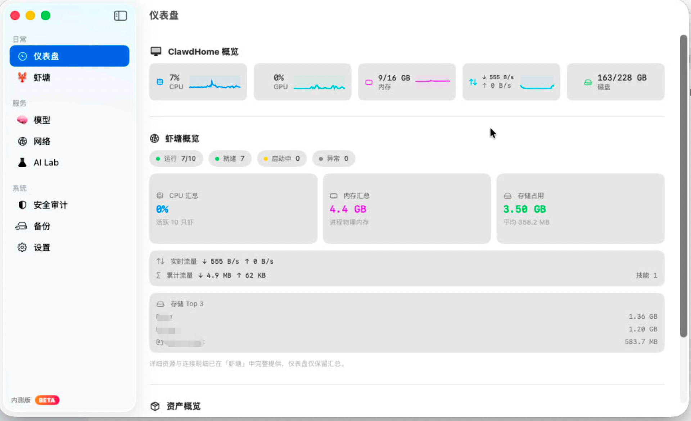
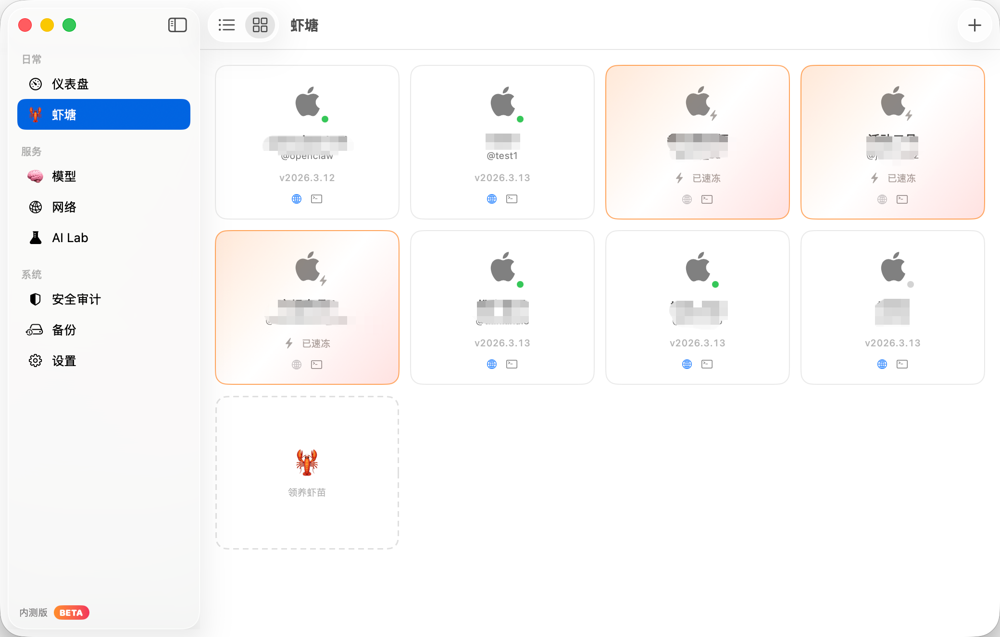
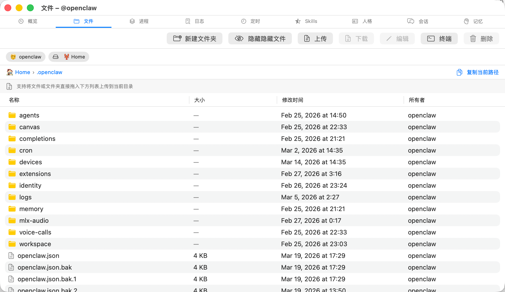
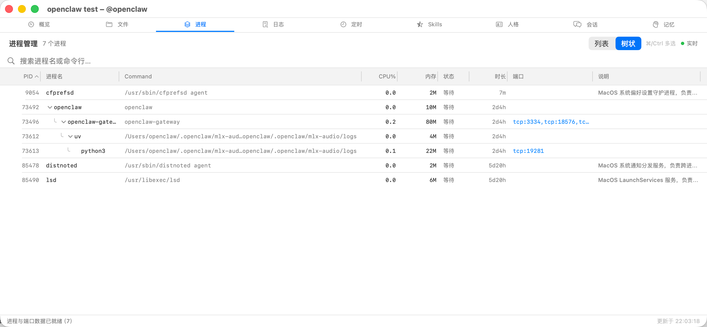

# ClawdHome

[](https://clawdhome.app)
[](https://developer.apple.com/swift/)
[](LICENSE)
[](https://github.com/ThinkInAIXYZ/clawdhome/releases)

[English](README.md) | 中文

> 面向 macOS 的原生控制平面，用一台 Mac 安全地运行、隔离并管理多个 OpenClaw gateway 实例。

ClawdHome 适合那些希望在一台机器上托管多只 OpenClaw “虾”，但又不希望身份、数据、权限和运维风险混在一起的人。它把 SwiftUI 管理应用、特权 XPC helper daemon 和 macOS 多用户隔离机制组合成一个完整工作流，用于初始化、监控、克隆、维护和恢复。

官网：[clawdhome.app](https://clawdhome.app)  
下载：[GitHub Releases](https://github.com/ThinkInAIXYZ/clawdhome/releases)  
更新记录：[中文](CHANGELOG.zh.md) | [English](CHANGELOG.en.md)

## 界面预览

<table>
  <tr>
    <td></td>
    <td></td>
  </tr>
  <tr>
    <td></td>
    <td></td>
  </tr>
</table>

## 为什么是 ClawdHome

- 真隔离：每只虾对应独立的 macOS 用户、运行时、数据目录和权限边界。
- 更安全的特权模型：系统级操作全部走显式 XPC helper，而不是在 UI 里临时拼 shell。
- 更快的试错节奏：可以克隆已有虾做实验、演练和回归验证，再把可行方案沉淀下来。
- 更适合 Mac 原生场景：相比虚拟机或容器，这类桌面自动化和系统交互工作流更适合直接利用 macOS 多用户能力。
- 运维入口统一：初始化、网关生命周期、文件、日志、进程、配置和诊断集中在一个界面里处理。

## 核心亮点

- 在一台 Mac 上隔离运行多只 OpenClaw gateway，并保持清晰的实例边界。
- 为新虾提供引导式初始化流程，支持微信等渠道的配对接入。
- 可以从已有虾克隆出新的隔离账号，用于低风险测试和发布演练。
- 提供网关生命周期管理、健康状态可视化，以及 watchdog 异常恢复能力。
- 内置文件、会话、进程、日志和维护工具，减少手工运维动作。
- 可直接在应用内配置模型与 provider，也支持通过 Role Market 采用预设方案。
- 支持本地 AI 运维集成，可在已配置环境下接入本地模型服务。
- 基于 `Stable.xcstrings` 提供中英文双语本地化。

## 架构概览

```text
ClawdHome.app（SwiftUI 管理界面）
  -> XPC -> ClawdHomeHelper（特权 LaunchDaemon）
      -> 按用户隔离的 OpenClaw gateway 实例
```

- `ClawdHome.app` 是面向操作者的控制平面，负责状态展示、初始化和日常运维。
- `ClawdHomeHelper` 是特权边界，负责用户管理、进程控制、文件操作、安装和系统级自动化。
- 每只虾都作为独立 macOS 用户运行，拥有各自的 OpenClaw 运行时与数据。

## 安全模型

- 特权操作集中在 helper 边界内。
- 敏感动作通过显式 XPC 方法完成，而不是任意 shell 调用。
- 关键生命周期流程内置归属和权限修复逻辑。
- 运行时资源按虾隔离，降低相互污染和误操作的影响范围。

## 快速开始

### 环境要求

- macOS 14+
- Xcode 15+
- 可选：[XcodeGen](https://github.com/yonaskolb/XcodeGen)

### 从源码启动

```bash
open ClawdHome.xcodeproj
```

如果你希望先重新生成工程：

```bash
xcodegen generate
open ClawdHome.xcodeproj
```

### 本地开发安装 Helper

```bash
make install-helper
```

等价直接命令：

```bash
sudo bash scripts/install-helper-dev.sh install
```

## 常用命令

| 目的 | 命令 |
| --- | --- |
| 构建 App（Debug） | `make build` |
| 只构建 Helper | `make build-helper` |
| 构建 Release 归档 | `make build-release` |
| 生成本地未签名安装包 | `make pkg` |
| 生成本地验收用已签名安装包 | `make pkg-signed` |
| 生成已签名且已公证安装包 | `make notarize-pkg` |
| 执行完整发布流程 | `make release NOTARIZE=true` |
| 直接运行导出的 Release App | `make run-release` |
| 安装最新生成的 pkg | `make install-pkg` |
| 卸载开发模式 Helper | `make uninstall-helper` |
| 实时查看 Helper 日志 | `make log-helper` |
| 实时查看 App 日志 | `make log-app` |
| 执行本地化检查 | `make i18n-check` |
| 清理构建产物 | `make clean` |

## 故障排查

### macOS 下 `npm install -g` 失败

先检查 Xcode Command Line Tools 是否可用：

```bash
xcode-select -p
```

如果命令失败，先安装：

```bash
xcode-select --install
```

如果遇到 Xcode license 错误，请使用管理员账号接受许可：

```bash
sudo xcodebuild -license
# 或非交互方式：
sudo xcodebuild -license accept
```

### 日志在哪里看

- Helper 日志：`/tmp/clawdhome-helper.log`
- App 日志流：`make log-app`

## 仓库结构

```text
ClawdHome/          SwiftUI 应用、视图、模型、服务
ClawdHomeHelper/    特权 helper daemon 与运维操作
Shared/             App 与 Helper 共享协议和数据模型
Resources/          LaunchDaemon plist 与打包资源
scripts/            构建、安装、打包、发布与 i18n 工具
docs/               项目文档与 README 配图资源
release-notes/      发布说明草稿
```

## 本地化

- 语言：中文、英文
- 字符串体系：`Stable.xcstrings`
- 检查命令：`make i18n-check`
- 说明文档：[docs/i18n.md](docs/i18n.md)

## 路线图

- [ ] 接入基于 exec 的外部密钥管理方案
- [ ] 更细粒度的网络访问控制管理
- [ ] 简化更多模型 provider 与 IM 渠道的配置流程
- [ ] 强化本地小模型工作流与 OpenClaw 集成
- [ ] 增强救援与诊断能力
- [ ] 优化 gateway 探测与历史健康追踪
- [ ] 完善更生产级的签名与公证分发流程

## 参与贡献

- 较大或结构性改动请先提 issue 讨论。
- PR 尽量保持小而聚焦，便于评审。
- 行为变更请附带验证证据。
- 不要提交本地或私有环境产物。
- 遵循现有 Swift 风格和项目目录约定。
- 当前仓库尚未配置自动化单元测试，因此 PR 中的手动验证说明尤其重要。

## Star History

<a href="https://www.star-history.com/?repos=ThinkInAIXYZ%2Fclawdhome&type=date&legend=top-left">
 <picture>
   <source media="(prefers-color-scheme: dark)" srcset="https://api.star-history.com/image?repos=ThinkInAIXYZ/clawdhome&type=date&theme=dark&legend=top-left" />
   <source media="(prefers-color-scheme: light)" srcset="https://api.star-history.com/image?repos=ThinkInAIXYZ/clawdhome&type=date&legend=top-left" />
   
 </picture>
</a>

## 许可证

项目使用 Apache License 2.0，详见 [LICENSE](LICENSE)。
